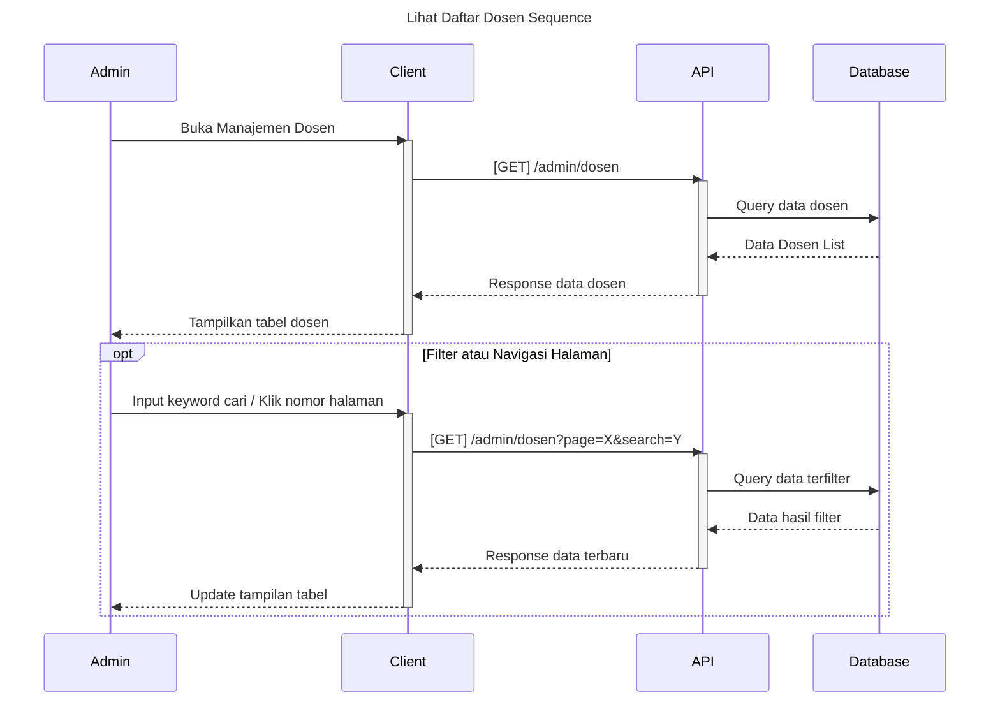
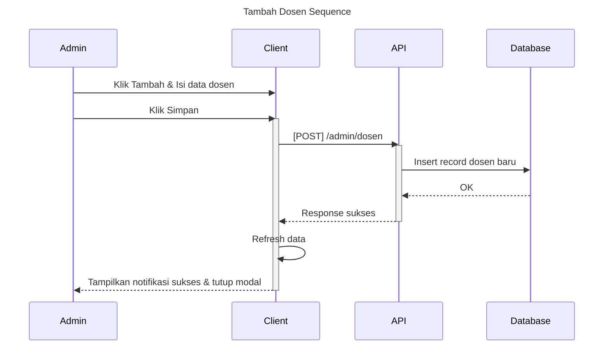
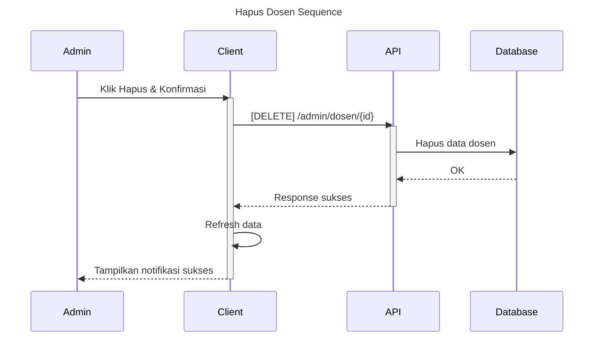

# CRUD Dosen

Dokumentasi alur pengelolaan data Dosen oleh Admin.

## Lihat Daftar Dosen

```mermaid
sequenceDiagram
    title Lihat Daftar Dosen Sequence

    participant Admin
    participant Client
    participant API
    participant Database

    Admin->>Client: Buka Manajemen Dosen
    activate Client
    Client->>API: [GET] /admin/dosen
    activate API
    API->>Database: Query data dosen
    Database-->>API: Data Dosen List
    API-->>Client: Response data dosen
    deactivate API
    Client-->>Admin: Tampilkan tabel dosen
    deactivate Client

    opt Filter atau Navigasi Halaman
        Admin->>Client: Input keyword cari / Klik nomor halaman
        activate Client
        Client->>API: [GET] /admin/dosen?page=X&search=Y
        activate API
        API->>Database: Query data terfilter
        Database-->>API: Data hasil filter
        API-->>Client: Response data terbaru
        deactivate API
        Client-->>Admin: Update tampilan tabel
        deactivate Client
    end
```

## Tambah Dosen

```mermaid
sequenceDiagram
    title Tambah Dosen Sequence

    participant Admin
    participant Client
    participant API
    participant Database

    Admin->>Client: Klik Tambah & Isi data dosen
    Admin->>Client: Klik Simpan
    activate Client
    Client->>API: [POST] /admin/dosen
    activate API
    API->>Database: Insert record dosen baru
    Database-->>API: OK
    API-->>Client: Response sukses
    deactivate API
    Client->>Client: Refresh data
    Client-->>Admin: Tampilkan notifikasi sukses & tutup modal
    deactivate Client
```

## Hapus Dosen

```mermaid
sequenceDiagram
    title Hapus Dosen Sequence

    participant Admin
    participant Client
    participant API
    participant Database

    Admin->>Client: Klik Hapus & Konfirmasi
    activate Client
    Client->>API: [DELETE] /admin/dosen/{id}
    activate API
    API->>Database: Hapus data dosen
    Database-->>API: OK
    API-->>Client: Response sukses
    deactivate API
    Client->>Client: Refresh data
    Client-->>Admin: Tampilkan notifikasi sukses
    deactivate Client
```
