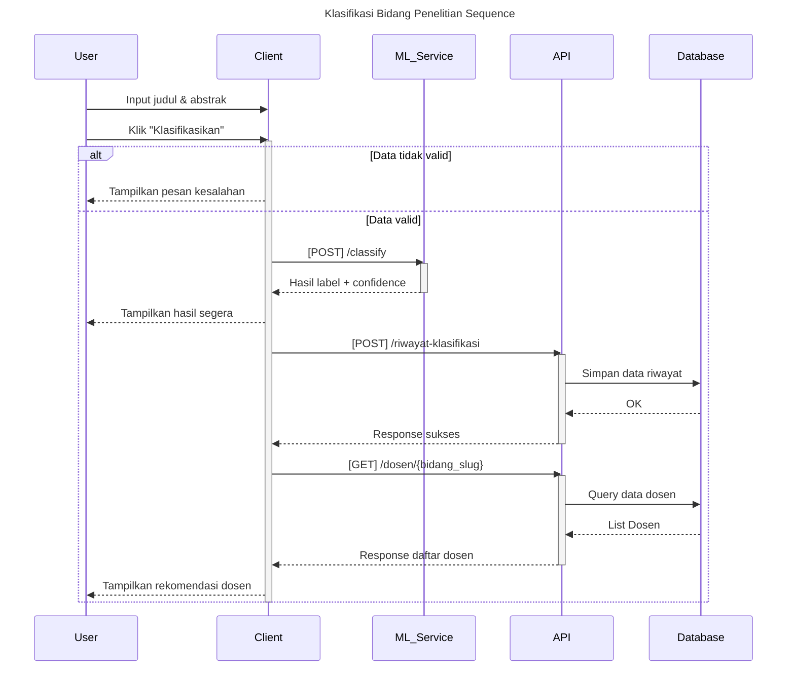

# Klasifikasi Bidang Penelitian

```mermaid
sequenceDiagram
    title Klasifikasi Bidang Penelitian Sequence

    participant User
    participant Client
    participant ML_Service
    participant API
    participant Database

    User->>Client: Input judul & abstrak
    User->>Client: Klik "Klasifikasikan"

    activate Client
    alt Data tidak valid
        Client-->>User: Tampilkan pesan kesalahan
    else Data valid
        Client->>ML_Service: [POST] /classify
        activate ML_Service
        ML_Service-->>Client: Hasil label + confidence
        deactivate ML_Service

        Client-->>User: Tampilkan hasil segera

            Client->>API: [POST] /riwayat-klasifikasi
            activate API
            API->>Database: Simpan data riwayat
            Database-->>API: OK
            API-->>Client: Response sukses
            deactivate API

            Client->>API: [GET] /dosen/{bidang_slug}
            activate API
            API->>Database: Query data dosen
            Database-->>API: List Dosen
            API-->>Client: Response daftar dosen
            deactivate API
            Client-->>User: Tampilkan rekomendasi dosen
    end
    deactivate Client
```
