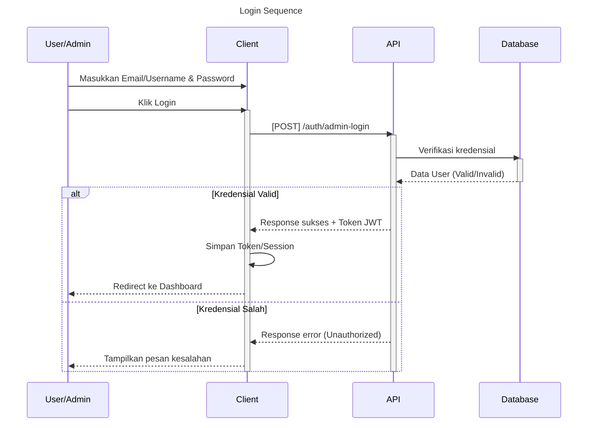

# Login

```mermaid
sequenceDiagram
    title Login Sequence

    participant User/Admin
    participant Client
    participant API
    participant Database

    User/Admin->>Client: Masukkan Email/Username & Password
    User/Admin->>Client: Klik Login

    activate Client
    Client->>API: [POST] /auth/admin-login
    activate API

    API->>Database: Verifikasi kredensial
    activate Database
    Database-->>API: Data User (Valid/Invalid)
    deactivate Database

    alt Kredensial Valid
        API-->>Client: Response sukses + Token JWT
        Client->>Client: Simpan Token/Session
        Client-->>User/Admin: Redirect ke Dashboard
    else Kredensial Salah
        API-->>Client: Response error (Unauthorized)
        Client-->>User/Admin: Tampilkan pesan kesalahan
    end
    deactivate API
    deactivate Client
```
