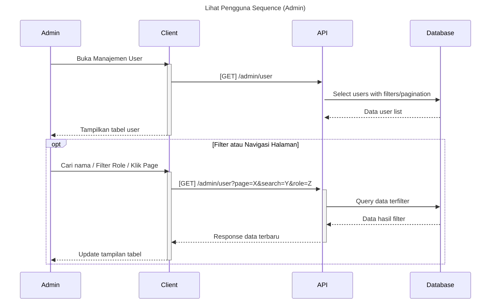
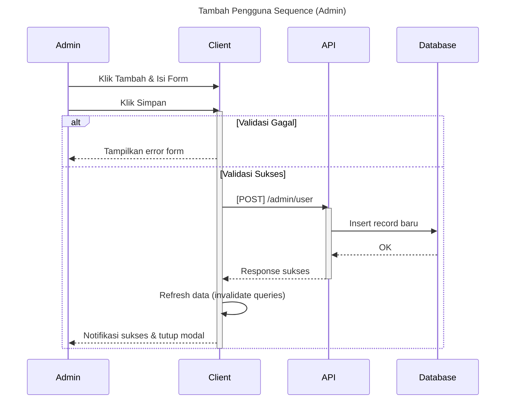
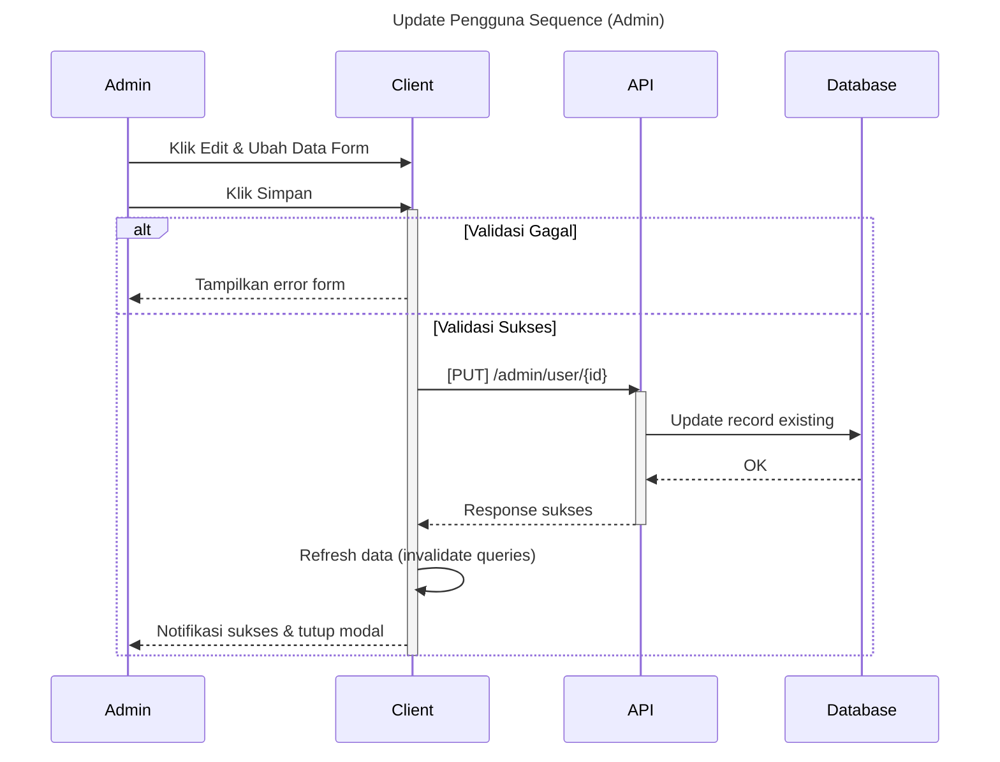
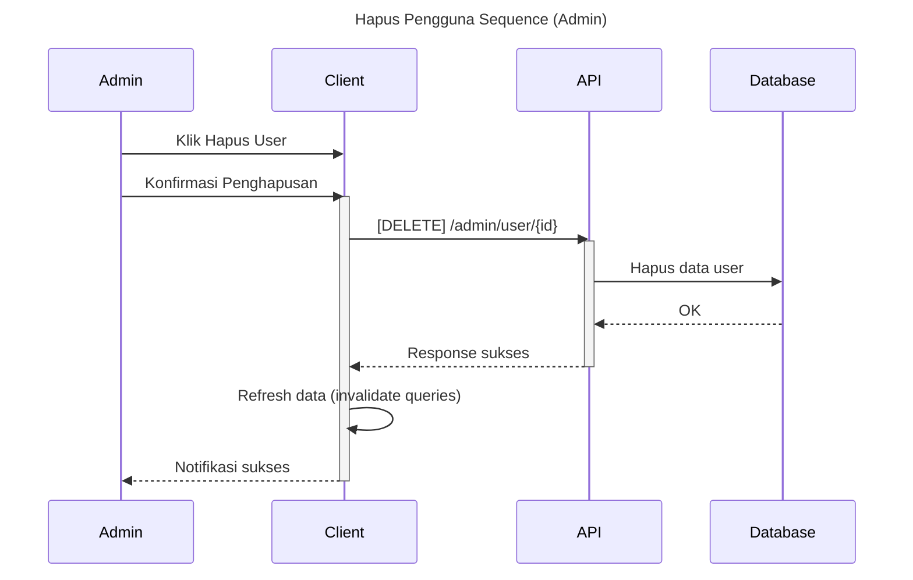

# Manajemen Pengguna

Dokumentasi alur manajemen pengguna oleh Admin.

## Lihat Daftar Pengguna

```mermaid
sequenceDiagram
    title Lihat Pengguna Sequence (Admin)

    participant Admin
    participant Client
    participant API
    participant Database

    Admin->>Client: Buka Manajemen User
    activate Client
    Client->>API: [GET] /admin/user
    activate API
    API->>Database: Select users with filters/pagination
    Database-->>API: Data user list
    Client-->>Admin: Tampilkan tabel user
    deactivate Client

    opt Filter atau Navigasi Halaman
        Admin->>Client: Cari nama / Filter Role / Klik Page
        activate Client
        Client->>API: [GET] /admin/user?page=X&search=Y&role=Z
        activate API
        API->>Database: Query data terfilter
        Database-->>API: Data hasil filter
        API-->>Client: Response data terbaru
        deactivate API
        Client-->>Admin: Update tampilan tabel
        deactivate Client
    end
```

## Tambah Pengguna

```mermaid
sequenceDiagram
    title Tambah Pengguna Sequence (Admin)

    participant Admin
    participant Client
    participant API
    participant Database

    Admin->>Client: Klik Tambah & Isi Form
    Admin->>Client: Klik Simpan
    activate Client

    alt Validasi Gagal
        Client-->>Admin: Tampilkan error form
    else Validasi Sukses
        Client->>API: [POST] /admin/user
        activate API
        API->>Database: Insert record baru
        Database-->>API: OK
        API-->>Client: Response sukses
        deactivate API
        Client->>Client: Refresh data (invalidate queries)
        Client-->>Admin: Notifikasi sukses & tutup modal
    end
    deactivate Client
```

## Update Pengguna

```mermaid
sequenceDiagram
    title Update Pengguna Sequence (Admin)

    participant Admin
    participant Client
    participant API
    participant Database

    Admin->>Client: Klik Edit & Ubah Data Form
    Admin->>Client: Klik Simpan
    activate Client

    alt Validasi Gagal
        Client-->>Admin: Tampilkan error form
    else Validasi Sukses
        Client->>API: [PUT] /admin/user/{id}
        activate API
        API->>Database: Update record existing
        Database-->>API: OK
        API-->>Client: Response sukses
        deactivate API
        Client->>Client: Refresh data (invalidate queries)
        Client-->>Admin: Notifikasi sukses & tutup modal
    end
    deactivate Client
```

## Hapus Pengguna

```mermaid
sequenceDiagram
    title Hapus Pengguna Sequence (Admin)

    participant Admin
    participant Client
    participant API
    participant Database

    Admin->>Client: Klik Hapus User
    Admin->>Client: Konfirmasi Penghapusan
    activate Client
    Client->>API: [DELETE] /admin/user/{id}
    activate API
    API->>Database: Hapus data user
    Database-->>API: OK
    API-->>Client: Response sukses
    deactivate API
    Client->>Client: Refresh data (invalidate queries)
    Client-->>Admin: Notifikasi sukses
    deactivate Client
```
