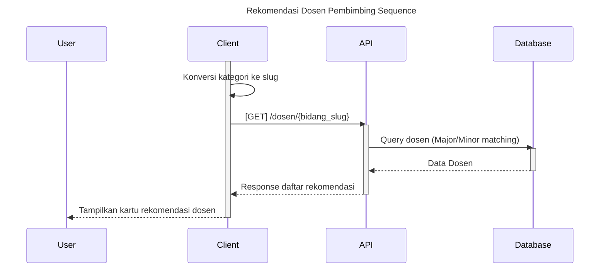

# Rekomendasi Dosen Pembimbing

```mermaid
sequenceDiagram
    title Rekomendasi Dosen Pembimbing Sequence

    participant User
    participant Client
    participant API
    participant Database

    activate Client
    Client->>Client: Konversi kategori ke slug

    Client->>API: [GET] /dosen/{bidang_slug}
    activate API

    API->>Database: Query dosen (Major/Minor matching)
    activate Database
    Database-->>API: Data Dosen
    deactivate Database

    API-->>Client: Response daftar rekomendasi
    deactivate API

    Client-->>User: Tampilkan kartu rekomendasi dosen
    deactivate Client
```
