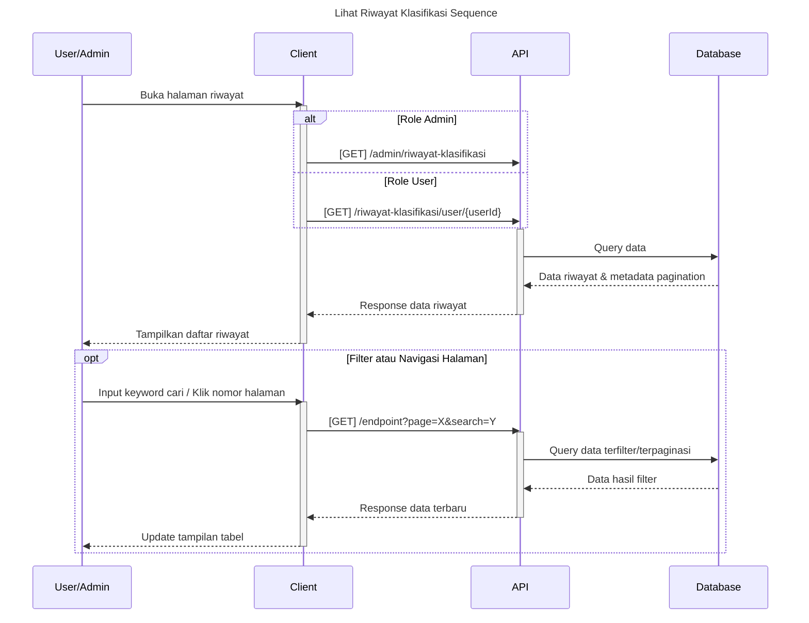

# Lihat Riwayat Klasifikasi

```mermaid
sequenceDiagram
    title Lihat Riwayat Klasifikasi Sequence

    participant User/Admin
    participant Client
    participant API
    participant Database

    User/Admin->>Client: Buka halaman riwayat

    activate Client

    alt Role Admin
        Client->>API: [GET] /admin/riwayat-klasifikasi
    else Role User
        Client->>API: [GET] /riwayat-klasifikasi/user/{userId}
    end

    activate API
    API->>Database: Query data
    Database-->>API: Data riwayat & metadata pagination
    API-->>Client: Response data riwayat
    deactivate API

    Client-->>User/Admin: Tampilkan daftar riwayat
    deactivate Client

    opt Filter atau Navigasi Halaman
        User/Admin->>Client: Input keyword cari / Klik nomor halaman
        activate Client
        Client->>API: [GET] /endpoint?page=X&search=Y
        activate API
        API->>Database: Query data terfilter/terpaginasi
        Database-->>API: Data hasil filter
        API-->>Client: Response data terbaru
        deactivate API
        Client-->>User/Admin: Update tampilan tabel
        deactivate Client
    end
```
