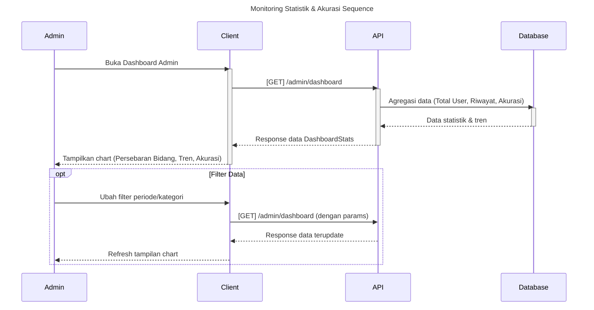

# Monitoring Statistik & Akurasi

```mermaid
sequenceDiagram
    title Monitoring Statistik & Akurasi Sequence

    participant Admin
    participant Client
    participant API
    participant Database

    Admin->>Client: Buka Dashboard Admin

    activate Client
    Client->>API: [GET] /admin/dashboard
    activate API

    API->>Database: Agregasi data (Total User, Riwayat, Akurasi)
    activate Database
    Database-->>API: Data statistik & tren
    deactivate Database

    API-->>Client: Response data DashboardStats
    deactivate API

    Client-->>Admin: Tampilkan chart (Persebaran Bidang, Tren, Akurasi)
    deactivate Client

    opt Filter Data
        Admin->>Client: Ubah filter periode/kategori
        Client->>API: [GET] /admin/dashboard (dengan params)
        API-->>Client: Response data terupdate
        Client-->>Admin: Refresh tampilan chart
    end
```
